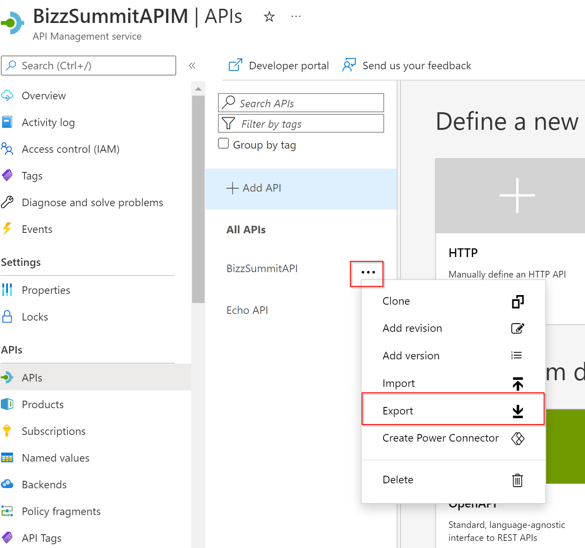
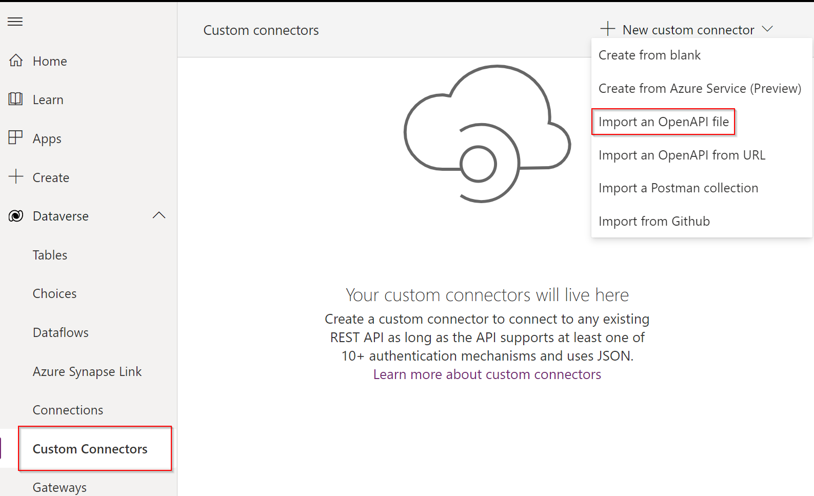
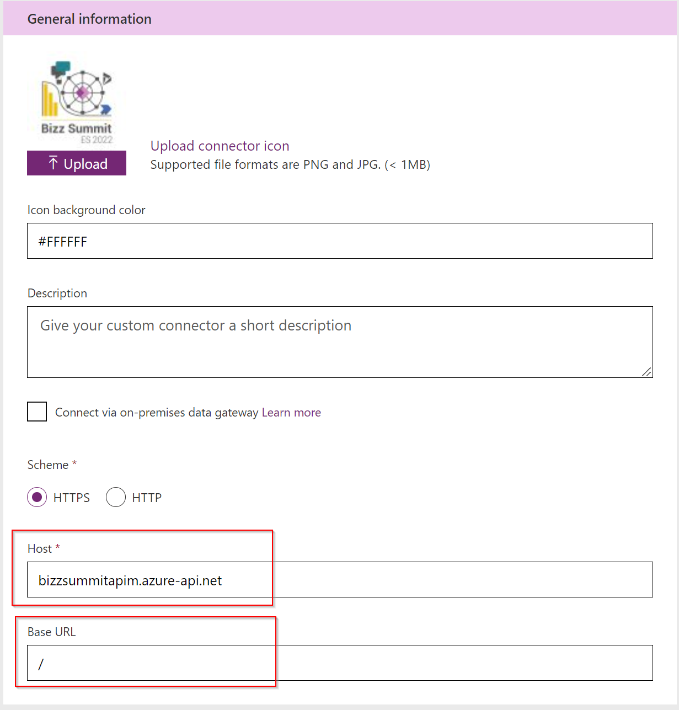
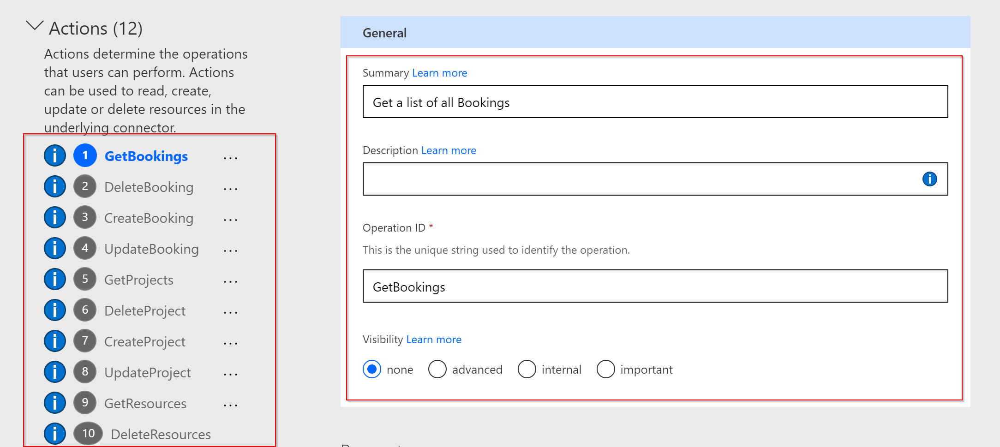
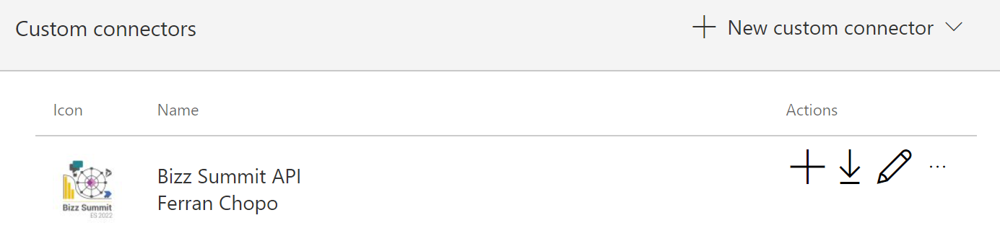
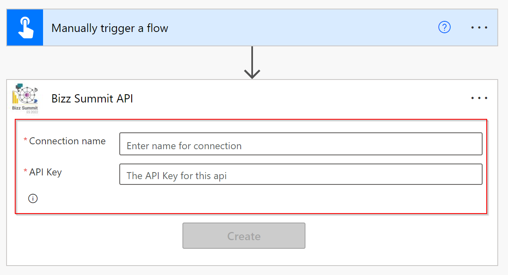
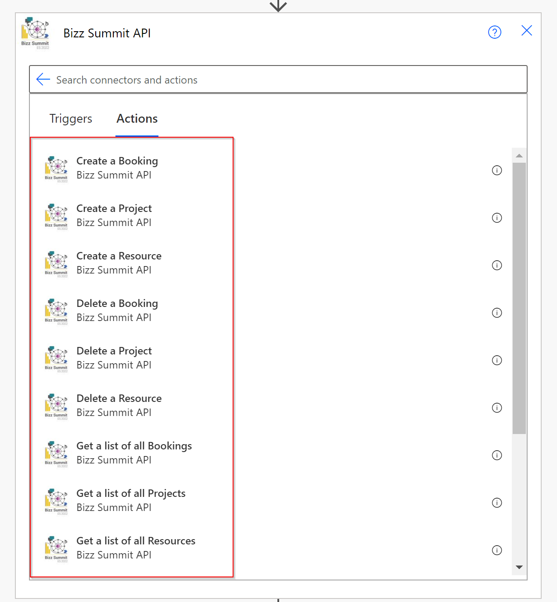

# BizzSummit2022 - Crear el conector personalizado
Fusion Teams Workshop for BizzSummit 2022
## Creación del conecto personalizado ##
Para poder utilizar la API será necesario crear el conector personalizado en nuestro entorno de Power Platform. El conector no deja der ser un fichero json o yaml con la definición de las distintas operaciones que éste tendra, así como información relativa a los parámetros de entrada y salida de cada una de estas operaciones.
Seguidamente presentamos los distintos pasos a seguir.
### Generar el fichero de definición del conector ###
Actualmente podemos crear conectores personzalidos si disponemos del fichero de definición en el formato [OpenAPI 2.0](https://swagger.io/specification/v2/). Para generar el fichero de definición del conector, debemos ir a la APIM (en Azure), seleccionar la API BizzSummitAPI y exportarla (Export):

También podemos comprobar como ya existe la posibilidad de crear el conector directamente (Create Power Connector), pero por ahora, exportaremos el fichero al formato Open API 2.0 (JSON).

### Creación del conector en nuestro entorno de Power Platform ###
Con la definición de las operaciones ya podemos crear nuestro conector personalizado. Para ello, iremos a la sección de conectores personalizados y crearemos el conector a partir del fichero OpenAPI que generamos anteriormente:

Seguidamente deberemos indicar los siguientes datos:
1. Nombre del conector y el fichero con la definición de las operaciones.
2. Icono que queremos asignar al conector, así como una descripción. Los campos *Host* y *Base URL* los dejaremos con los valores por defecto, ya que deberían indicar el host de nuestra APIM en Azure, así como dirección base de la misma. 

3. Método de seguridad que queremos utilizar para acceder a las operaciones. El método seleccionado será *API Key*, de forma que cada vez que llámemos a un método de la API, se pasará mediante el parámetro *Ocp-Apim-Subscription-Key* en la cabecera (*Header*) el valor de la clave (la deberemos indicar cuando creemos la conexión al usar el conector personalizado).

4. Acciones que tendrá el conector. Para cada acción deberemos indicar el nombre único que deseamos asignarle, así como un resumen y descripción de la misma. Adicionalmente podemos indicar la [visibilidad](https://docs.microsoft.com/es-es/connectors/custom-connectors/openapi-extensions#x-ms-visibility) de la acción cuando usemos el conector. Es importante mencionar que no podemos tener carácteres especiales en el identificador de la acción.

Podemos comprobar que gracias a la importación del fichero, las acciones ya están definidas, con los objetos o parámetros de entrada, así como los resultados que devolverán cada una de ellas. Sin la definición del fichero, todas esta información se debería introducir manualmente.

Finalmente guardaremos los cambios haciendo click en *Crear conector*. Si todo ha ido bien, deberíamos ver el nuevo conector en la lista de conectores personalizados:

### Uso del conecto personalizado ###
La primera vez que deseemos utilizar el conector personalizado, deberemos crear la conexión, en la que indicaremos el valor de la *API Key*, que si recordáis, es necesario para poder autenticar las peticiones.

A partir de este momento ya se podrán elegir cualquiera de las acciones del conector:

