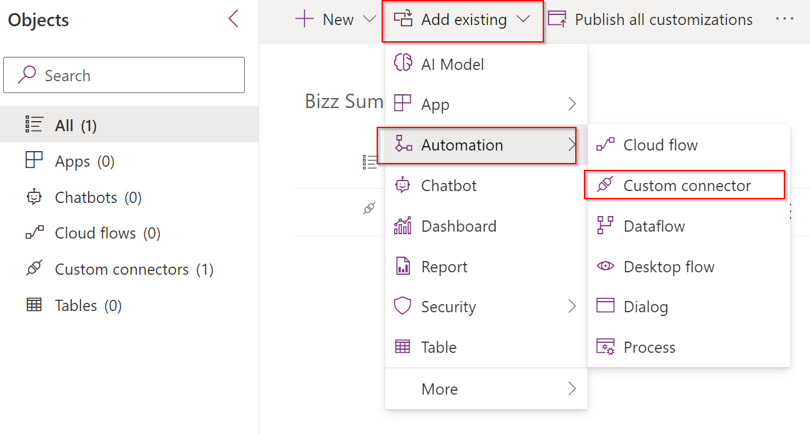
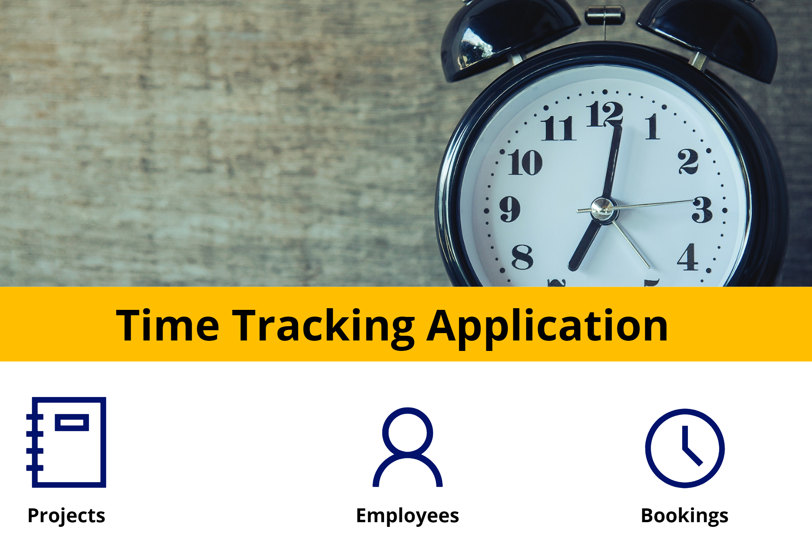

# BizzSummit2022 - Crear el conector personalizado
Fusion Teams Workshop for BizzSummit 2022
## Creación de la solución ##
Antes de empezar a crear nuestra aplicación en Power Apps, recomendamos agrupar todos los componentes bajo una misma [solución](https://docs.microsoft.com/es-es/power-apps/maker/data-platform/solutions-overview). En este sentido, queremos tener la aplicación, los flujos y el conector personalizado en la misma solución, facilitando todas las tareas relativas al mantenimiento de nuestra herramienta de gestión del tiempo.

### Desarollo de la aplicación en Power Apps ###
Ahora ya estamos listos para poder desarrollar nuestra aplicación de gestión del tiempo en Power Apps. La aplicación debería incluir aspectos como:
1. Acceso por parte de usuarios administradores para:
- Crear, modificar o eliminar proyectos.
- Crear, modificar o eliminar la asignación de personas a proyectos.
2. Acceso por parte de usuarios:
- Introducir nuevos partes de horas.
- Consultar y modificar partes de horas existentes.
