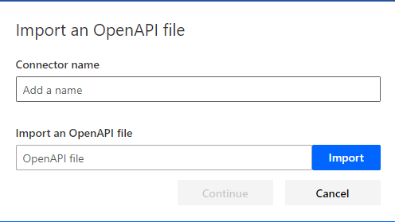
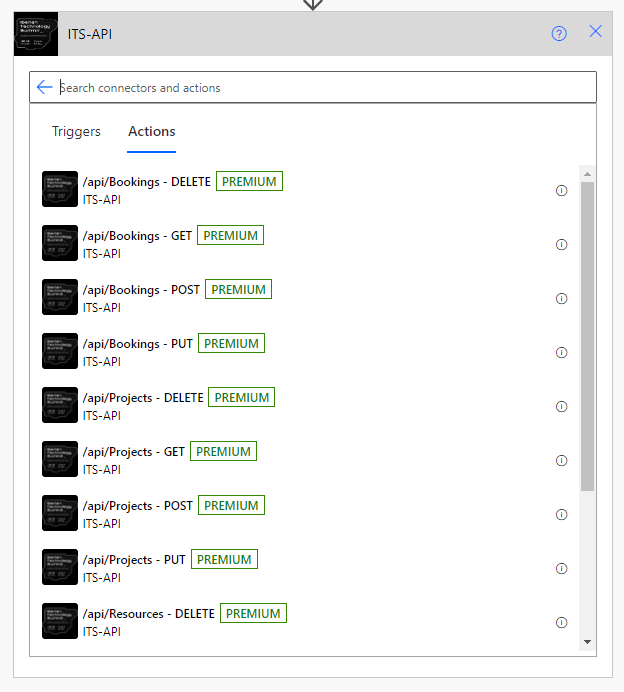

# Iberian Technology Summit - Create custom connector
Introduction to Fusion Teams Development for ITS 2023

## Creation of the custom connector ##
In order to use the API it will be necessary to create the customized connector in our Power Platform environment. The connector is a json or yaml file with the definition of the different operations that it will have, as well as information related to the input and output parameters of each one of these operations.
Next we present the different steps to follow.

### Generate the connector definition file ###
Currently, we can create customized connectors if we have the definition file in the [OpenAPI 2.0](https://swagger.io/specification/v2/) format. To generate the connector definition file, we must go to the APIM (in Azure), select the ITSAPI and export it (Export):

We can also see that there is already the possibility to create the connector directly (Create Power Connector), but for now, we will export the file to Open API 2.0 format (JSON).

### Connector creation in our Power Platform environment ###
With the definition of the operations we can now create our custom connector. To do this, we will go to the custom connectors section and create the connector from the OpenAPI file we generated earlier:

Then we must indicate the following data:
1. Name of the connector and the file with the definition of the operations.
2. Icon that we want to assign to the connector, as well as a description. The fields *Host* and *Base URL* will be left with the default values, since they should indicate the host of our APIM in Azure, as well as its base address.

3. Security method that we want to use to access the operations. The selected method will be *API Key*, so that every time we call an API method, the value of the key will be passed through the parameter *Ocp-Apim-Subscription-Key* in the header (*Header*) (we will have to indicate it when we create the connection when using the custom connector).

4. Actions that the connector will have. For each action we must indicate the unique name we want to assign to it, as well as a summary and description of the action. Additionally we can indicate the action [visibility](https://docs.microsoft.com/es-es/connectors/custom-connectors/openapi-extensions#x-ms-visibility) when using the connector. It is important to mention that we cannot have special characters in the identifier of the action.

We can see that thanks to the import of the file, the actions are already defined, with the input objects or parameters, as well as the results that each of them will return. Without the file definition, all this information would have to be entered manually.

Finally we will save the changes by clicking on *Create Connector*. If everything went well, you should see the new connector in the list of custom connectors:

### Use of the custo connector ###
The first time we want to use the custom connector, we will have to create the connection, in which we will indicate the value of the *API Key*, which, if you remember, is necessary to authenticate the requests.

From this moment on, any of the connector's actions can be selected:

