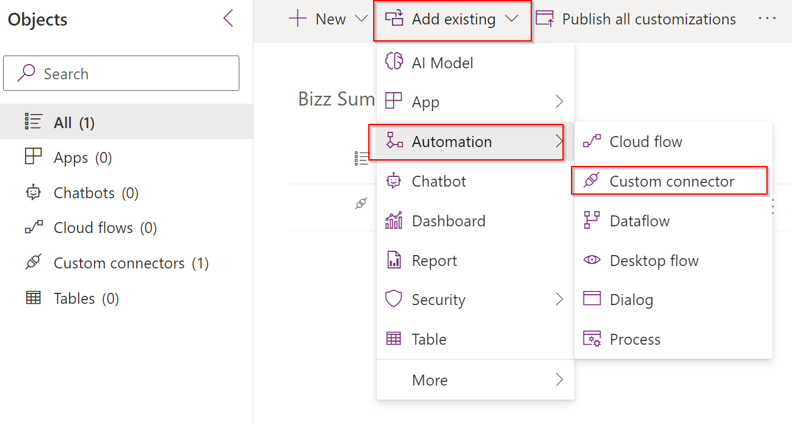

# Iberian Technology Summit - Create Custom Connector
Introduction to Fusion Teams development at ITS 2023

## Creation of the solution ##
Before starting to create our application in Power Apps, we recommend grouping all the components under the same [solution](https://docs.microsoft.com/es-es/power-apps/maker/data-platform/solutions-overview). In this sense, we want to have the application, the flows and the customized connector in the same solution, facilitating all the tasks related to the maintenance of our time management tool.

### Application development in Power Apps ###
Now we are ready to develop our time management application in Power Apps. The application should include aspects such as:
1. Access by administrator users to:
- Create, modify or delete projects.
- Create, modify or delete the assignment of people to projects.
2. Access by users:
- Enter new timesheets.
- Search and modify existing timesheets.

